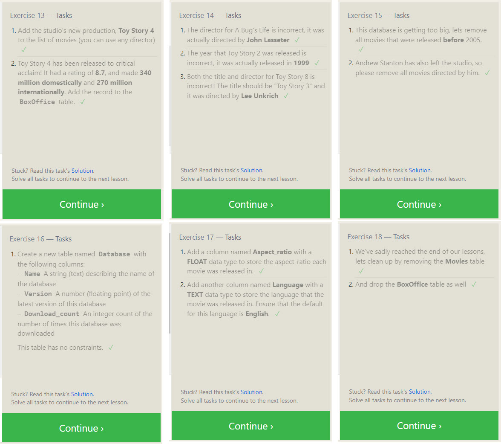

# Relational Databases & SQL

A relational database is a type of database that organizes data into tables, with each table representing a specific entity or concept. These tables are related to one another through the use of common fields, or keys, which allow for the creation of relationships between the data in different tables. Relational databases have the ability to efficiently store and retrieve large amounts of structured data, as well as to easily perform complex queries and analysis on that data.

Some common SQL commands include:

- SELECT: used to retrieve data from one or more tables in a database
- INSERT: used to add new data rows into a table
- UPDATE: used to modify existing data rows in a table
- DELETE: used to remove data rows from a table
- CREATE: used to create a new database table
- ALTER: used to add, remove, or modify columns in a table
- DROP: used to remove an entire table including all of its data and metadata

